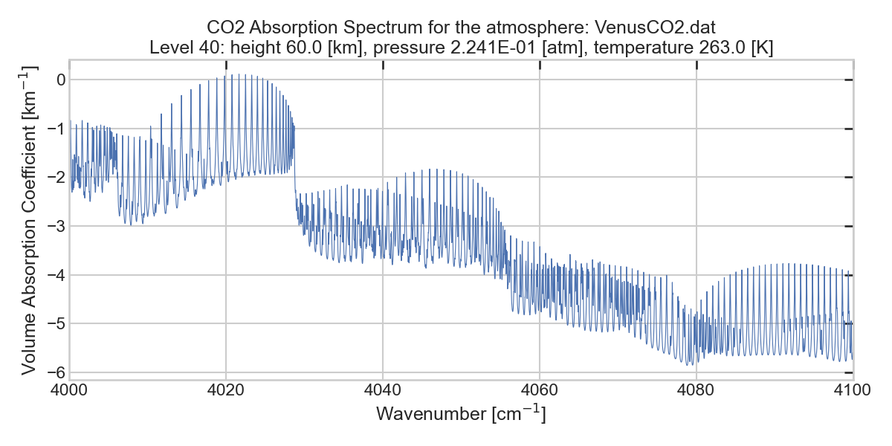
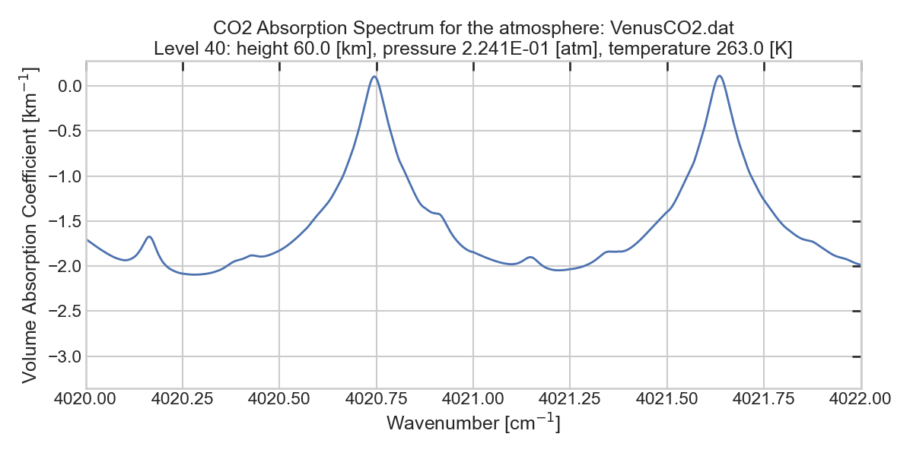

# MARFA
## Overview
MARFA (Molecular Atmospheric Absorption with Rapid and Flexible Analysis) is a versatile tool designed to calculate volume absorption coefficients or monochromatic absorption cross-sections using initial spectroscopic data from sources such as the HITRAN and HITEMP databases. With MARFA, users can generate absorption look-up tables for each atmospheric level simultaneously within seconds. These look-up tables are produced in a binary format, making them easily integrable into radiative transfer codes. Originally developed to facilitate the modeling of radiative transfer in Venus's atmosphere, MARFA's flexible design allows it to be adapted to a wide range of spectroscopic and atmospheric scenarios.

In addition to using and contributing to the source code, it is recommended to interact with the web interface of the tool to better understand its capabilities. The web interface can be accessed at: <URL>

## Features

- **Efficient Line-by-Line Technique**: Utilizes an effective interpolation method [Fomin, 1995] with nine grids to accelerate the summation of contributions from a large number of spectral lines.

- **Atmospheric Profile Handling**: Computes output absorption spectra for all atmospheric levels in a single runtime.

- **Line Shapes Support**: Supports standard line shapes, including Doppler, Lorentz, and Voigt (default). Additional line shapes can be manually added.

- **Line Wings Corrections**: Implements various chi-factors to accommodate sub-Lorentzian behavior of spectral line wings. Currently chi-factors are implemented for CO₂ used for Venus atmosphere. Custom chi-factors can be manually added.

- **Line Cut-Off Criterion**: Allows users to set input parameters to control accuracy and align with continuum parameters.

- **Line Databases Support**: Includes HITRAN2016 databases for CO₂ and H₂O within the source code. Other spectral databases can be incorporated by preprocessing them into the required format.

- **PT-Tables Generation**: Produces resulting spectra as direct-access files in PT-format (each output PT-file corresponds to one atmospheric level), which can be directly integrated into radiative transfer schemes.

- **Additional Tools**: Provides various scripts for plotting and data processing, facilitating validation and the integration of new data.

## Prerequisites
To build and run the source code on your machine, you need to have GFortran (GNU Fortran compiler) and the Fortran Package Manager (fpm) installed. 
The tool is compatible with macOS, Linux and Windows operating systems. However, installation might be challenging for Windows unexperienced users.

### Fortran compiler: Gfortran
For installing the `gfortran` you can use [GNU Fortran website](https://gcc.gnu.org/fortran/) or use your system's package manager.
#### Other compilers:
Other fortran compilers were not tested and checked.
### fpm
Installation instructions ara available on the [official website](https://fpm.fortran-lang.org/install/index.html) or on the [fpm github page](https://github.com/fortran-lang/fpm).
### Python3
Python3 is mainly needed for running the plotting scripts and converting binary files to a human readable format.

## Quick start instructions
### Clone the repository and navigate to the project directory:

```
git clone https://github.com/Razumovskyy/MARFA
cd MARFA
```
### Build the project
```
fpm build
```
### Install python packages
In python virtual environment (recommended) run:
```
pip install -r requirements.txt
```
### Choose the atmospheric file
For a quick start you can choose one of the default atmospheric profiles located in the `data/Atmospheres` folder. For example `data/Atmospheres/VenusCO2.dat` which reflects the carbon dioxide profile in the Venus nightside atmosphere.
### Run the project with some command line parameters
For example:
```
fpm run marfa -- CO2 4000 4100 125 tonkov VAC VenusCO2.dat
```

Here is a breakdown of the command-line arguments:
- **`CO2`**: The input molecule
- **`4000`** and **`4100`**: The boundaries of the spectral interval of interest (in cm<sup>-1</sup>)
- **`125`**: The line cut-off condition (in cm<sup>-1</sup>)
- **`tonkov`**: The name of the chi-factor correction used for CO₂.
- **`VAC`** Specifies the target calculated value as volume absorption coefficient.
- **`VenusCO2.dat`** The atmospheric profile file to read pressure, tempareature and molecular density data from.

After running this command, the PT-tables for each level from the `VenusCO2.dat` file will be generated in the `output/ptTables` folder. The output files are created in binary format (direct access files) to facilitate faster integration with radiative transfer models.

### Converting to a human-readable output and plotting
To convert a specific PT-table file to a human-readable format and plot the spectra, use the Python script located in the scripts directory. Execute the following command:
```
python scripts/postprocess.py --v1 4000 --v2 4100 --level 40 --resolution medium --plot
```
You can find the file containing human-readable data in the `processedData` folder, named according to the corresponding format, e.g., `output/processedData/CO2_40_VAC_4000-4100.dat`. Below is an example of the file’s content, which includes log information and data: the first column represents wavenumbers [cm<sup>-1</sup>], and the second column shows the log<sub>10</sub> of the volume absorption coefficient (or cross-section if `targetValue` is set to VAC).
```ini
# Input Molecule: CO2
# Cut Off: 125
# Chi Factor Function Name: tonkov
# Target Value: VAC
# Atmospheric Profile File: VenusCO2.dat
# V1: 4000.0 cm-1
# V2: 4100.0 cm-1
# Resolution: medium
# Level Number: 40
               1       20470
     4000.00000        -1.4572563
     4000.00488        -1.4536923
     4000.00977        -1.4693524
     4000.01465        -1.4902035
      ...
     4099.98535        -5.6071868
     4099.99023        -5.5950541
```
If the `--plot` flag is enabled, a plot of the data set is generated and saved to the `plots` directory with the same name, for example: `output/plots/CO2_40_VAC_4000-4100.png`. Here’s an example:



The `V1` and `V2` values do not necessarily need to match the initial boundaries of the spectral interval used to calculate the PT-table. Instead, you can examine a narrower interval with higher resolution to gain more detailed insights:
```
python scripts/postprocess.py --v1 4020 --v2 4022 --level 40 --resolution high --plot
```



## Command line parameters: overview
## Atmospheric profile file structure
## Output PT-table file structure
## Spectral databases
## Chi-factors
## Performance overview
## Introducing custom features
## Troubleshooting

## License
This project is licensed under the MIT License. See the LICENSE file for more details.

## References
- Fomin, B.A. (1995). _Effective interpolation technique for line-by-line calculations of radiation absorption in gases_. Journal of Quantitative Spectroscopy and Radiative Transfer, 53(6), 663–669.
